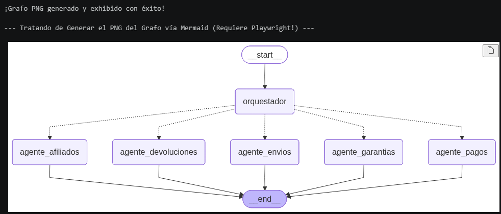
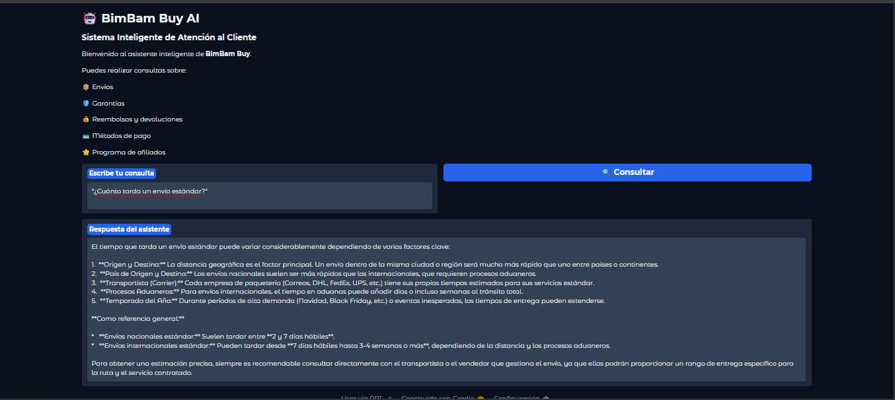
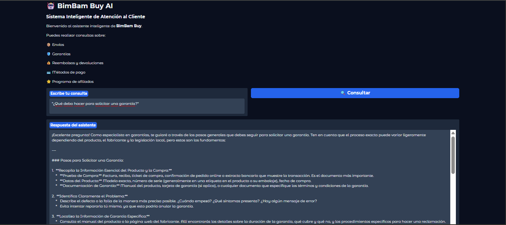
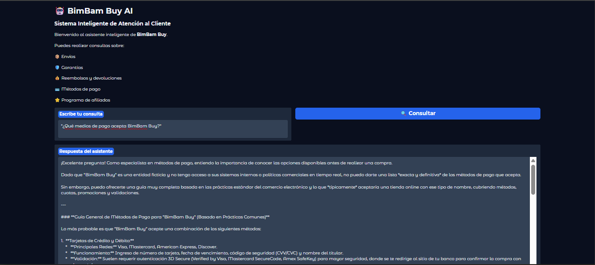
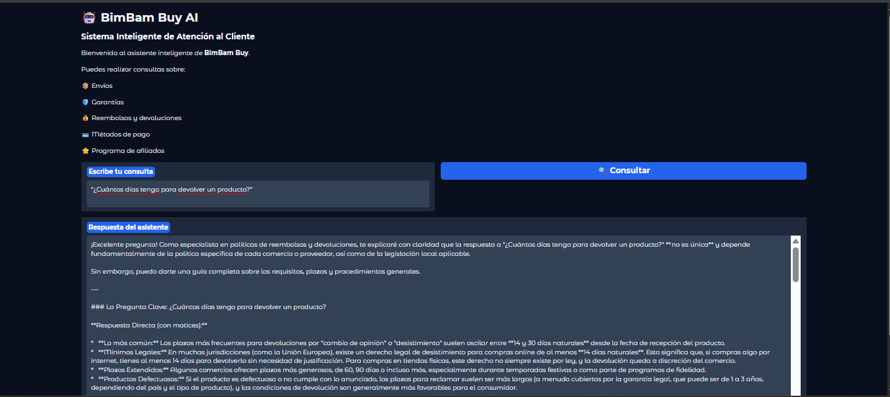
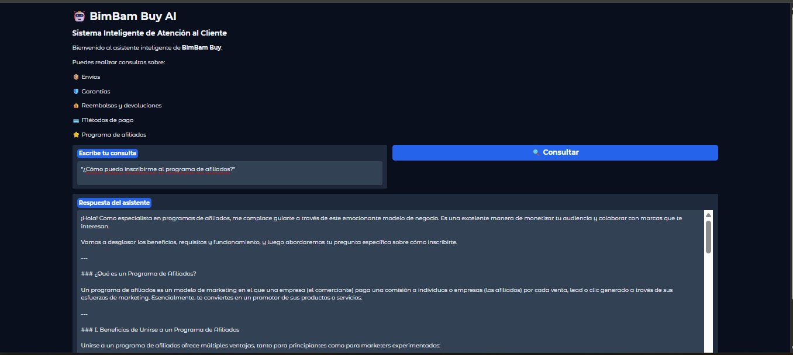

# 🤖 BimBam Buy AI – Multiagente Inteligente con LangGraph y RAG

> **Asistente inteligente de atención al cliente desarrollado con Inteligencia Artificial Generativa, LangGraph, LangChain, FAISS y Google Gemini.**

---

## 📌 Descripción del proyecto

**BimBam Buy AI** es un asistente virtual basado en una arquitectura **Multiagente**, diseñado para responder consultas de clientes de una tienda de comercio electrónico.

El sistema utiliza un **agente orquestador** que analiza cada consulta y la deriva automáticamente al agente especializado correspondiente.

Cada agente consulta una **base documental independiente** mediante **RAG (Retrieval-Augmented Generation)** utilizando índices **FAISS**, permitiendo generar respuestas fundamentadas en documentación oficial.

---

## 🌍 Aplicabilidad

Si bien este proyecto fue desarrollado para un escenario de **comercio electrónico**, la arquitectura implementada puede adaptarse fácilmente a otros sectores que requieran automatizar la atención y gestión de consultas, como:

- 🏦 Banca y servicios financieros
- 🛡️ Seguros
- 🏥 Salud
- 🎓 Educación
- 🏢 Servicios corporativos
- 🛒 Retail

La combinación de **IA Generativa**, **RAG** y una arquitectura **Multiagente** permite construir asistentes especializados, escalables y basados en conocimiento documental.

---

## 🚀 Tecnologías utilizadas

* 🐍 Python
* 🧠 Google Gemini
* 🔗 LangChain
* 🕸️ LangGraph
* 📚 FAISS Vector Store
* 📄 PyPDFLoader
* ✂️ RecursiveCharacterTextSplitter
* 💬 Gradio
* 💻 Streamlit
* 💾 SQLite (Checkpointer)
* 🌐 Git & GitHub

---

## 🏗️ Arquitectura del proyecto

```text
Usuario
    │
    ▼
Agente Orquestador
    │
    ├──────────────► Agente Envíos
    │
    ├──────────────► Agente Garantías
    │
    ├──────────────► Agente Devoluciones
    │
    ├──────────────► Agente Pagos
    │
    └──────────────► Agente Afiliados

Cada agente consulta su propio índice FAISS
construido a partir de documentación PDF.
```

---

## 🤖 Agentes especializados

### 📦 Agente de Envíos

Responde consultas relacionadas con:

* tiempos de entrega
* costos de envío
* modalidades de envío
* cobertura

---

### 🛡️ Agente de Garantías

Especializado en:

* garantías
* cobertura
* plazos
* procedimientos

---

### 💰 Agente de Reembolsos y Devoluciones

Gestiona consultas sobre:

* devoluciones
* reembolsos
* cambios
* condiciones

---

### 💳 Agente de Métodos de Pago

Responde consultas relacionadas con:

* medios de pago
* cuotas
* promociones
* validaciones

---

### ⭐ Agente de Afiliados

Especializado en:

* inscripción
* beneficios
* funcionamiento del programa
* requisitos

---

## 📚 Base documental (RAG)

El asistente consulta cinco documentos independientes:

* 📄 Guía de Tiempos y Costos de Envío
* 📄 Manual de Garantías
* 📄 Política de Reembolsos y Devoluciones
* 📄 Preguntas Frecuentes sobre Métodos de Pago
* 📄 Programa de Afiliados

Cada documento fue procesado mediante:

* carga del PDF
* división en *chunks*
* generación de *embeddings*
* almacenamiento en índices **FAISS**

---

## 🧠 Funcionamiento

1. El usuario realiza una consulta.
2. El Agente Orquestador identifica el tema.
3. Selecciona el agente especializado.
4. El agente consulta el índice FAISS correspondiente.
5. Se recupera el contexto más relevante.
6. Google Gemini genera una respuesta basada en la documentación.

---

## 🖥️ Interfaz

La aplicación cuenta con una interfaz web desarrollada con **Streamlit Community Cloud** para la demostración pública del asistente.

Inicialmente se desarrolló una interfaz con **Gradio** para pruebas locales del sistema multiagente.

---

## 📸 Capturas del proyecto

### Diagrama del grafo



---

### Interfaz del asistente











---

## 📂 Estructura del proyecto

```text
.
├── app.py
├── streamlit_app.py
├── backend.py
├── Multiagente.ipynb
├── requirements.txt
├── data/
│   └── pdfs/
├── faiss_envios/
├── faiss_garantias/
├── faiss_devoluciones/
├── faiss_pagos/
├── faiss_afiliados/
└── imágenes/
```

---

## ⚙️ Instalación

Clonar el repositorio:

```bash
git clone https://github.com/evs-11/ai-ecommerce-agent.git
```

Ingresar al proyecto:

```bash
cd ai-ecommerce-agent
```

Crear un entorno virtual:

```bash
python -m venv .venv
```

Activarlo:

### Windows

```bash
.venv\Scripts\activate
```

Instalar dependencias:

```bash
pip install -r requirements.txt
```

---

## ▶️ Ejecución local

Para ejecutar la aplicación con Streamlit:

```bash
streamlit run streamlit_app.py
```

La aplicación estará disponible localmente en:

```text
http://localhost:8501
```

---

## 💡 Características principales

* ✅ Arquitectura Multiagente
* ✅ LangGraph
* ✅ Orquestación inteligente
* ✅ RAG con documentación PDF
* ✅ Índices FAISS persistentes
* ✅ Recuperación de contexto
* ✅ Google Gemini
* ✅ Interfaz web con Streamlit
* ✅ Interfaz Gradio utilizada durante desarrollo
* ✅ Persistencia mediante SQLite
* ✅ Código modular

---

## 🚀 Aplicación desplegada

La aplicación está disponible públicamente en Streamlit Community Cloud:

**Demo online:**  

https://ai-ecommerce-agent-bimbambuy.streamlit.app/

---

## 🎥 Video demostrativo

Video de funcionamiento del asistente:

https://drive.google.com/file/d/1aeiLPiKYeoswRU-SBcwODXi7ww17XyPQ/view?usp=sharing

---

## 👩‍💻 Autor

**Elida Schultz**

---

## ⭐ Agradecimientos

A **Alura Latam** y a **Oracle Next Education (ONE)** por brindar la oportunidad de desarrollar este proyecto aplicando técnicas modernas de Inteligencia Artificial Generativa, recuperación aumentada (RAG) y arquitecturas Multiagente.

---

## 📌 Notas

El código y la documentación son parte del portfolio profesional de la autora.
